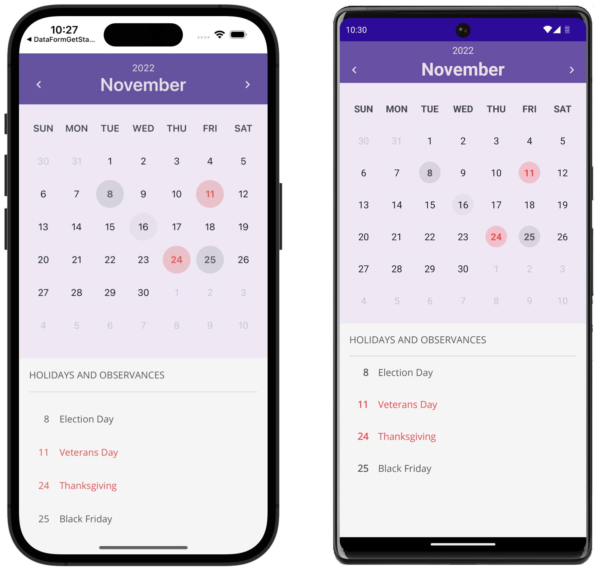

<!-- default badges list -->

<!-- default badges end -->
# DevExpress Calendar for .NET MAUI

[DevExpress Mobile UI](https://www.devexpress.com/maui/) allows you to use a .NET cross-platform UI toolkit and C# to build native apps for iOS and Android.

The **DevExpress Mobile UI for Xamarin.Forms and .NET MAUI** is free of charge. To learn more about our offer and to reserve your copy, visit [Free DevExpress Mobile UI for Xamarin.Forms and .NET MAUI](https://www.devexpress.com/xamarin-free).

## Requirements

Please register the [DevExpress NuGet Gallery](https://nuget.devexpress.com) in Visual Studio to restore the NuGet packages used in this solution. See the following topic for more information: [Get Started with DevExpress Mobile UI for .NET MAUI](https://docs.devexpress.com/MAUI/403249/get-started).

## What's in This Repository

The DevExpress Calendar for .NET MAUI allows your users to select a date. You can customize the appearance of days, months, years, and the calendar's header as your business needs dictate. For example, you can highlight holidays and observances. You can update fonts and colors, or completely change the data template used to render a specific visual element.

To learn more about the calendar, see the following help topic: [DXCalendar](http://docs.devexpress.com/MAUI/DevExpress.Maui.Editors.DXCalendar).

### Files to Look At

<!-- default file list -->
* [MauiProgram.cs](./CS/MauiProgram.cs)
* [MainPage.xaml](./CS/MainPage.xaml)
* [MainPage.xaml.cs](./CS/MainPage.xaml.cs)
* [ViewModel.cs](./CS/ViewModel.cs)
* [USCalendar.cs](./CS/USCalendar.cs)
<!-- default file list end -->

## Documentation

- [Data Grid](https://docs.devexpress.com/MAUI/403255/data-grid/data-grid)
- [Charts](https://docs.devexpress.com/MAUI/403300/charts/charts)
- [Data Form](https://docs.devexpress.com/MAUI/403640/data-form)
- [Tab View](https://docs.devexpress.com/MAUI/403297/navigation/index)
- [Data Editors](https://docs.devexpress.com/MAUI/403427/editors/index)
- [Collection View](https://docs.devexpress.com/MAUI/403324/collection-view/index)

## More Examples

* [Stocks App](https://github.com/DevExpress-Examples/maui-stocks-mini)
* [Pie Chart](https://github.com/DevExpress-Examples/maui-pie-chart-get-started)
* [Scatter Chart](https://github.com/DevExpress-Examples/maui-scatter-chart-get-started)
* [Data Form](https://github.com/DevExpress-Examples/maui-data-form-get-started)
* [Tab View](https://github.com/DevExpress-Examples/maui-tab-view-get-started)
* [Data Editors](https://github.com/DevExpress-Examples/maui-editors-get-started)
* [Collection View](https://github.com/DevExpress-Examples/maui-collection-view-get-started)
